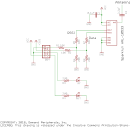

### RF315: Keyfob Receiver Cards

The RF315 and RFOB cards let you receive packets from your keychain 315
MHz or 434 MHz transmitter. Both cards take an RF module similar to the
Sparkfun WRL-10532 or the WRL-10533. The RF315 card has a built-in 315
MHz antenna while the RFOB card has an SMA antenna connector. The RF315
card is convenient while the RFOB card lets you place the antenna where
you choose.

|
||

 
**Features:**  
 \- Internal or External antenna option 
 \- 315 or 434 MHz receiver modules available 
 \- LEDs to indicate received packets and RF signal 

 

**Hardware:**  
The schematic and layout of the RF315 are shown below. The Eagle
schematic and board files for the internal antenna version are available
here: [rf315i.sch](rf315i.sch) and [rf315i.brd](rf315i.brd). The Eagle
schematic and board files for the SMA connector version are available here:
[rfob.sch](rfob.sch) and [rfob.brd](rfob.brd).

 

| |
 |

