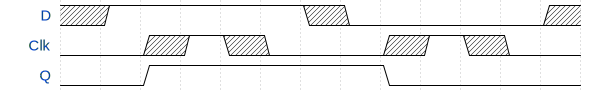

## Daughter Cards from Demand Peripherals
[dpadc12](dpadc12/adc12.md): Octal 12-bit analog to digital converter  
[dpdac8](dpdac8/dac8.md): Octal 8-bit digital to analog converter  
[dpei2c](dpei2c/ei2c.md): Ringing tolerant I2C interface  
[dpespi](dpespi/espi.md): Ringing tolerant SPI interface  
[dpin32](dpin32/in32.md): 32 channel binary input  
[dpio8](dpio8/io8.md): Octal input and output  
[dplcd6](dplcd6/lcd6.md):  Six digit 7-segment display  
[dpmega](dpmega/mega.md): AVR card  
[dpout32](dpout32/out32.md): 32 channel binary output  
[dpqpot](dpqpot/qpot.md): Quad 10K digital pot  
[dprtc](dprtc/rtc.md): Real-time clock with alarm  
[dpslider4](dpslider4/slider4.md): Quad slide pot  
[dptif](dptif/tif.md): Text interface card  
[dpus8](dpus8/us8.md): Octal HC-04 distance sensor interface  

## Design Notes
All of the boards in this directory use a 7474 dual D-type flip-flop
to recover clean clock pulses even with ringing on all the lines 
from the FPGA.

The original Demand Peripherals FPGA board uses cables to connect to
daughter cards with the connectors or electronic for the peripheral.
Ribbon cables like this are an invitation for problems with ringing.

Traditional approaches use termination networks to **suppress** 
ringing, but suppression is not elimination and depending on the
cable length and frequency suppression can fail.

To overcome the problems of suppression the company decided to
**tolerate** ringing on the cables by quadrature encoding the clock
and using a D flip-flop to recover the clock.  This timing diagram
shows how the Q output of the D flip-flop does not have ringing and
could be used as a clean clock source for shift registers, SPI, or
I2C.  This circuit can also fail due to ringing but for frequencies
in the megahertz range the cable lenght to cause problems is very
long.

Using a quadrature encoded clock solves the ringing problem but 
requires an extra pin from the FPGA.  Since both Pmod and Demand
peripherals card have four FPGA pins this approach will not work
for SPI or shift registers with both output and input.  Demand
Peripherals solved this problem by using the second D flip-flop
in the 7474 to latch the chip select line.  The following schematic
shows the final circuit.

This circuit is protected by US Patent Number 10,324,889 which is
assigned to Demand Peripherals.  The circuit is free to use for
non-commercial projects and a 15 year license costs less than one
hundred dollars for commercial projects.  If you want long cable
runs you should use this circuit.

